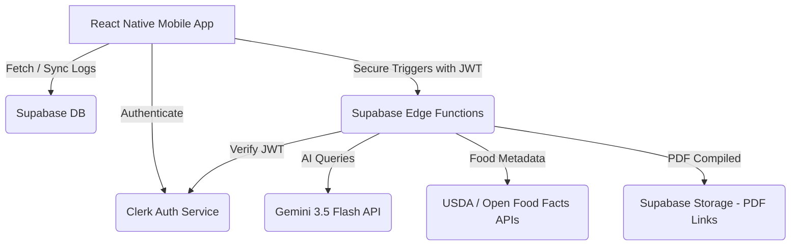

# Master Design Specification: digest

Welcome to the master design specification for **digest**, a premium, multi-lingual (Arabic/English) health and nutrient tracking mobile application. This app combines the macro/micro tracking rigor of Chronometer with the meal-planning intelligence of Eat This Much, powered by Gemini 3.5 Flash AI, a Supabase serverless database backend, Clerk authentication, and a high-taste minimalist UI built with NativeWind/Tailwind.

---

## 1. Project Overview & Architecture

### Technology Stack
*   **Frontend Mobile Client:** React Native (Expo) in TypeScript.
*   **Authentication:** Clerk (`@clerk/clerk-expo`) for user management.
*   **State & Storage:** Local cache with AsyncStorage. State management with Zustand.
*   **Database & Backend:** Supabase (Database, Edge Functions, Storage).
*   **AI Engine:** Gemini 3.5 Flash (via Supabase Edge Functions callouts to Gemini API).
*   **Styling & Motion:** 
    *   NativeWind / Tailwind CSS for styling.
    *   `pressto` (high-performance spring-based tap and press states via `react-native-reanimated` + `react-native-gesture-handler`).
    *   `react-native-reanimated` and custom easings for page transitions and visual graphs.
*   **Utilities:** `react-native-keyboard-controller` for seamless keyboard alignment; `expo-localization` for locale settings.

### Serverless Hybrid Architecture (Approach 2 with Clerk)
The application communicates with Clerk for authentication tokens. Once authenticated, API requests to Supabase check the user's Clerk user ID (verified via JWT) to query personal logs.



---

## 2. Global Visual Design System

### Theme: Premium Minimalist Light Mode
The app focuses on a spacious, warm-alabaster aesthetic with deep natural forest colors and soft pastel indicators. Styled strictly using **NativeWind**.

#### Styling Tokens (Tailwind CSS Configuration)
*   `bg-base`: `bg-[#F8F9F8]` (Warm Alabaster)
*   `bg-card`: `bg-white` (Pure White)
*   `border-muted`: `border-[#EAECEB]` (Light Olive-Gray border)
*   `text-primary`: `text-[#1A1E1C]` (Deep Forest Charcoal)
*   `text-muted`: `text-[#626A66]` (Muted Olive-Gray)
*   `accent-sage`: `bg-[#4C6E58]` / `text-[#4C6E58]` (Deep Sage Green - primary CTA)
*   `accent-mint`: `bg-[#E2ECD7]` (Pastel Sage Mint - active badges/pills)
*   `nutrient-calories`: `bg-[#E58C73]` (Warm Terracotta / Coral)
*   `nutrient-protein`: `bg-[#7E9DB0]` (Soft Slate Blue)
*   `nutrient-carbs`: `bg-[#D3B177]` (Warm Honey Gold)
*   `nutrient-fats`: `bg-[#9CA19E]` (Soft Pewter)

#### Typography (Expo Google Fonts)
*   **Headers:** `Outfit` (Bold / SemiBold) — geometric, premium feel.
*   **Body & Utility Labels:** `Inter` (Regular / Medium / Bold) — high legibility.

#### Component Elevation & Borders
*   **Border Radius:** Bento panels: `rounded-3xl` (24px). Secondary items/buttons: `rounded-2xl` (16px). Tags/Badges: `rounded-xl` (12px).
*   **Card Shadows:** Soft drop shadows using standard NativeWind class utility styling (`shadow-sm` or custom shadow configuration).
*   **Tap Animations:** Managed exclusively via `pressto` tags wrapper, reducing items by 2% scale on push and returning with dynamic spring stiffness.

---

## 3. Global Database Schema (Supabase / Postgres with Clerk Auth)

*Note: Since Clerk user IDs are strings (e.g., `user_29w8y...`) and not UUIDs, user mapping tables reference text IDs instead of `UUID REFERENCES auth.users`.*

```sql
-- 1. Profiles Table (Linked to Clerk User IDs)
CREATE TABLE public.profiles (
    id TEXT PRIMARY KEY, -- Clerk user_id string
    email TEXT UNIQUE NOT NULL,
    display_name TEXT,
    language VARCHAR(5) DEFAULT 'ar',
    country VARCHAR(3) DEFAULT 'EG',
    date_of_birth DATE NOT NULL,
    gender VARCHAR(10) CHECK (gender IN ('male', 'female', 'other')),
    height_cm NUMERIC(5, 2) NOT NULL,
    weight_kg NUMERIC(5, 2) NOT NULL,
    activity_level VARCHAR(20) CHECK (activity_level IN ('sedentary', 'lightly_active', 'moderately_active', 'very_active')),
    health_goal VARCHAR(20) CHECK (health_goal IN ('lose_weight', 'maintain_weight', 'gain_weight')),
    target_calories NUMERIC(6, 1) DEFAULT 2000.0,
    target_protein_g NUMERIC(5, 1) DEFAULT 120.0,
    target_carbs_g NUMERIC(5, 1) DEFAULT 200.0,
    target_fat_g NUMERIC(5, 1) DEFAULT 65.0,
    target_water_ml NUMERIC(6, 1) DEFAULT 2500.0,
    created_at TIMESTAMPTZ DEFAULT NOW(),
    updated_at TIMESTAMPTZ DEFAULT NOW()
);

-- Enable RLS for Profiles
ALTER TABLE public.profiles ENABLE ROW LEVEL SECURITY;
-- Profiles are secured based on authenticated claims passed in the request header via Clerk JWT
CREATE POLICY "Users can manage their own profiles." ON public.profiles
    FOR ALL USING (auth.jwt() ->> 'sub' = id);

-- 2. Foods Cache Table (Global caching layer for all API/AI-parsed lookups)
CREATE TABLE public.foods_cache (
    id TEXT PRIMARY KEY, -- 'usda:<fdc_id>' or 'off:<barcode>' or 'gemini:<hash>' or 'custom:<uuid>'
    name_en TEXT NOT NULL,
    name_ar TEXT NOT NULL,
    brand TEXT,
    barcode TEXT,
    source VARCHAR(20) DEFAULT 'usda',
    calories_per_100g NUMERIC(6, 2) NOT NULL,
    protein_per_100g NUMERIC(5, 2) NOT NULL,
    carbs_per_100g NUMERIC(5, 2) NOT NULL,
    fat_per_100g NUMERIC(5, 2) NOT NULL,
    micros JSONB DEFAULT '{}'::jsonb,
    created_at TIMESTAMPTZ DEFAULT NOW()
);

-- Enable RLS for Foods Cache
ALTER TABLE public.foods_cache ENABLE ROW LEVEL SECURITY;
CREATE POLICY "Anyone can read cached food items." ON public.foods_cache
    FOR SELECT USING (true);
CREATE POLICY "Authorized backend can insert to foods cache." ON public.foods_cache
    FOR INSERT WITH CHECK (true);

-- 3. Food Logs Table (Daily intake)
CREATE TABLE public.food_logs (
    id UUID DEFAULT gen_random_uuid() PRIMARY KEY,
    user_id TEXT REFERENCES public.profiles(id) ON DELETE CASCADE NOT NULL,
    food_id TEXT REFERENCES public.foods_cache(id) NOT NULL,
    meal_type VARCHAR(15) CHECK (meal_type IN ('breakfast', 'lunch', 'dinner', 'snacks')),
    amount_g NUMERIC(6, 2) NOT NULL,
    logged_date DATE DEFAULT CURRENT_DATE NOT NULL,
    logged_at TIMESTAMPTZ DEFAULT NOW() NOT NULL,
    created_at TIMESTAMPTZ DEFAULT NOW()
);

-- Enable RLS for Food Logs
ALTER TABLE public.food_logs ENABLE ROW LEVEL SECURITY;
CREATE POLICY "Users can manage their own food logs." ON public.food_logs
    FOR ALL USING (auth.jwt() ->> 'sub' = user_id);

-- 4. Water Logs Table
CREATE TABLE public.water_logs (
    id UUID DEFAULT gen_random_uuid() PRIMARY KEY,
    user_id TEXT REFERENCES public.profiles(id) ON DELETE CASCADE NOT NULL,
    amount_ml NUMERIC(5, 1) NOT NULL,
    logged_date DATE DEFAULT CURRENT_DATE NOT NULL,
    logged_at TIMESTAMPTZ DEFAULT NOW() NOT NULL
);

ALTER TABLE public.water_logs ENABLE ROW LEVEL SECURITY;
CREATE POLICY "Users can manage their own water logs." ON public.water_logs
    FOR ALL USING (auth.jwt() ->> 'sub' = user_id);

-- 5. Workout Logs Table
CREATE TABLE public.workout_logs (
    id UUID DEFAULT gen_random_uuid() PRIMARY KEY,
    user_id TEXT REFERENCES public.profiles(id) ON DELETE CASCADE NOT NULL,
    activity_name_en TEXT NOT NULL,
    activity_name_ar TEXT NOT NULL,
    met_value NUMERIC(3, 1) NOT NULL,
    duration_minutes NUMERIC(4, 1) NOT NULL,
    calories_burned NUMERIC(6, 1) NOT NULL,
    logged_date DATE DEFAULT CURRENT_DATE NOT NULL,
    logged_at TIMESTAMPTZ DEFAULT NOW() NOT NULL
);

ALTER TABLE public.workout_logs ENABLE ROW LEVEL SECURITY;
CREATE POLICY "Users can manage their own workout logs." ON public.workout_logs
    FOR ALL USING (auth.jwt() ->> 'sub' = user_id);

-- 6. Generated Recipes Table (AI suggestions and user cookbook)
CREATE TABLE public.generated_recipes (
    id UUID DEFAULT gen_random_uuid() PRIMARY KEY,
    user_id TEXT REFERENCES public.profiles(id) ON DELETE SET NULL, -- Null if global/public recipe
    title_en TEXT NOT NULL,
    title_ar TEXT NOT NULL,
    description_en TEXT,
    description_ar TEXT,
    ingredients JSONB NOT NULL,
    steps_en JSONB NOT NULL,
    steps_ar JSONB NOT NULL,
    total_calories NUMERIC(6, 1) NOT NULL,
    total_protein_g NUMERIC(5, 1) NOT NULL,
    total_carbs_g NUMERIC(5, 1) NOT NULL,
    total_fat_g NUMERIC(5, 1) NOT NULL,
    image_url TEXT,
    country_origin VARCHAR(3) DEFAULT 'EG',
    created_at TIMESTAMPTZ DEFAULT NOW()
);

ALTER TABLE public.generated_recipes ENABLE ROW LEVEL SECURITY;
CREATE POLICY "Anyone can read recipes." ON public.generated_recipes
    FOR SELECT USING (true);
CREATE POLICY "Users can insert their own recipes." ON public.generated_recipes
    FOR INSERT WITH CHECK (auth.jwt() ->> 'sub' = user_id);

-- 7. Meal Plans & Shopping Lists Table
CREATE TABLE public.meal_plans (
    id UUID DEFAULT gen_random_uuid() PRIMARY KEY,
    user_id TEXT REFERENCES public.profiles(id) ON DELETE CASCADE NOT NULL,
    title TEXT NOT NULL,
    plan_data JSONB NOT NULL,
    grocery_list JSONB DEFAULT '[]'::jsonb,
    created_at TIMESTAMPTZ DEFAULT NOW()
);

ALTER TABLE public.meal_plans ENABLE ROW LEVEL SECURITY;
CREATE POLICY "Users can manage their own meal plans." ON public.meal_plans
    FOR ALL USING (auth.jwt() ->> 'sub' = user_id);
```

---

## 4. Product File Directory Structure

```
/
├── App.tsx                  # Root Component (ClerkProvider setup)
├── app.json                 # Expo config
├── package.json             # App dependencies
├── /assets                  # Local images, localized assets, fonts
│   ├── /fonts               # Outfit & Inter .ttf files
│   └── /images              # Local fallbacks
├── /src                     # Main source code (TypeScript)
│   ├── /api                 # Client callers for Supabase & Clerk hooks
│   ├── /components          # Reusable components (styled with NativeWind)
│   ├── /context             # LocaleContext, LogContext
│   ├── /i18n                # Translation dictionaries (ar.json, en.json)
│   ├── /navigation          # Bottom Tabs & Clerk Auth Stack configuration
│   ├── /screens             # Application Screens (grouped logically)
│   │   ├── /auth            # Onboarding & Clerk Sign-up Hook screens
│   │   ├── /dashboard       # Home Dashboard
│   │   ├── /food            # Loggers, Search, Barcode scanner view
│   │   ├── /recipes         # Recipe Explorer, AI Refrigerator Generator
│   │   ├── /workouts        # Activity burn selector
│   │   └── /profile         # User settings, goals, export panel
│   ├── /store               # Zustand Stores (e.g., useAuthStore, useDiaryStore)
│   ├── /types               # Global TS types (user.ts, food.ts, logs.ts)
│   ├── /theme               # Tailwind styles & global.css
│   └── /utils               # Local storage (AsyncStorage), keyboard-controller configs
├── /supabase                # Backend Configuration
│   ├── config.toml
│   └── /functions           # Supabase Edge Functions (with Clerk verification middleware)
│       ├── /parse-meal
│       ├── /scan-image
│       ├── /build-recipe
│       └── /export-pdf
```

---

## 5. Detailed Feature Specifications & Prompts

*   **Authentication & Onboarding Spec:** [auth_profile.md](file:///d:/digest/docs/features/auth_profile.md)
*   **Dashboard & Motion Spec:** [dashboard_ui.md](file:///d:/digest/docs/features/dashboard_ui.md)
*   **Food Search & Caching Spec:** [food_tracking.md](file:///d:/digest/docs/features/food_tracking.md)
*   **AI Vision Scanner Spec:** [ai_vision.md](file:///d:/digest/docs/features/ai_vision.md)
*   **AI Recipes & Recommendations Spec:** [ai_recipes.md](file:///d:/digest/docs/features/ai_recipes.md)
*   **PDF Export Engine Spec:** [pdf_export.md](file:///d:/digest/docs/features/pdf_export.md)
