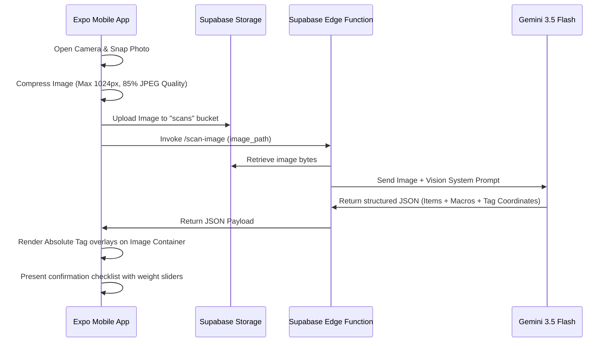

# Feature Specification: AI Vision Scanner (Image Recognition)

This specification details the end-to-end multi-modal vision logging flow, the coordinate system for rendering interactive food tags over images, and the system prompt for Gemini 3.5 Flash Vision.

---

## 1. Camera Vision Flow



---

## 2. Gemini 3.5 Flash Vision System Prompt

### Prompt
```
You are an expert nutritional vision system. You analyze pictures of meals and detect all individual ingredients and food components.
Estimate the name, portion weight (in grams), and general location of each food component in the image.

For the coordinates:
Return an 'anchor_point' containing [x, y] coordinates representing the center of the food item on the image. 
Use a scale of 0 to 100 where [0, 0] is the top-left corner and [100, 100] is the bottom-right corner. This allows the mobile app to render absolute positioned tags over the image.

Follow these strict rules:
1. Identify all recognizable foods.
2. Estimate the weight of each component in grams based on standard portion sizing visible in the image.
3. Translate names to both English ('name_en') and Arabic ('name_ar').
4. Compute standard macro values per 100g.
5. Return a raw JSON payload conforming to the schema. Do not write markdown tags or preambles.

JSON Schema:
{
  "detected_items": [
    {
      "name_en": "String - English food name",
      "name_ar": "String - Arabic food name",
      "amount_g": Number - Estimated weight of this component in grams,
      "anchor_point": [Number, Number], // [x, y] coordinates in 0-100 scale
      "calories_per_100g": Number,
      "protein_per_100g": Number,
      "carbs_per_100g": Number,
      "fat_per_100g": Number
    }
  ]
}
```

---

## 3. UI Tag Overlay Rendering (React Native)

When the vision API returns coordinates in the 0–100 scale, the client renders floating tags absolutely positioned over the compressed image container using `pressto` pressable tags.

```javascript
import React from 'react';
import { View, Image, Text, StyleSheet } from 'react-native';
import { PresstoButton } from '../components/PresstoButton';

export function ImageTagOverlay({ imageUrl, detectedItems, onSelectTag, containerWidth, containerHeight }) {
  return (
    <View style={[styles.container, { width: containerWidth, height: containerHeight }]}>
      <Image source={{ uri: imageUrl }} style={styles.image} resizeMode="cover" />
      
      {detectedItems.map((item, index) => {
        // Convert 0-100 coordinates to absolute pixels
        const left = (item.anchor_point[0] / 100) * containerWidth;
        const top = (item.anchor_point[1] / 100) * containerHeight;

        return (
          <PresstoButton
            key={index}
            onPress={() => onSelectTag(item)}
            style={[styles.tagContainer, { left: left - 40, top: top - 15 }]}
          >
            <View style={styles.badgeLine} />
            <View style={styles.badgeDot} />
            <View style={styles.tagBadge}>
              <Text style={styles.tagText}>
                {item.name_ar} ({item.amount_g}g)
              </Text>
            </View>
          </PresstoButton>
        );
      })}
    </View>
  );
}

const styles = StyleSheet.create({
  container: {
    position: 'relative',
    borderRadius: 24,
    overflow: 'hidden',
    backgroundColor: '#FAF9F6',
  },
  image: {
    width: '100%',
    height: '100%',
  },
  tagContainer: {
    position: 'absolute',
    alignItems: 'center',
    zIndex: 10,
  },
  badgeDot: {
    width: 8,
    height: 8,
    borderRadius: 4,
    backgroundColor: '#FFFFFF',
    borderWidth: 2,
    borderColor: '#4C6E58',
  },
  badgeLine: {
    width: 2,
    height: 20,
    backgroundColor: '#FFFFFF',
  },
  tagBadge: {
    backgroundColor: 'rgba(26, 30, 28, 0.85)', // Dark charcoal transparent backdrop
    paddingHorizontal: 10,
    paddingVertical: 5,
    borderRadius: 12,
    marginTop: 4,
  },
  tagText: {
    color: '#FFFFFF',
    fontSize: 11,
    fontFamily: 'Inter-Medium',
  },
});
```

---

## 4. Item Selection & Confirmation Checklist

After snapping the photo and receiving the API payload:
1.  **Checklist Sheet:** A bottom sheet lists the identified items with checkboxes.
2.  **Fine-Tuning Weight Sliders:** Selecting any item displays a slider to adjust the estimated grams (e.g. from 50g to 500g), instantly updating the caloric preview at the bottom of the screen.
3.  **Confirm CTA:** The user taps the green primary CTA (*"+ Log to Diary"*), which saves the logs to Supabase database.

---
*End of Specification. Next Spec: AI Recipes & Recommendations.*
