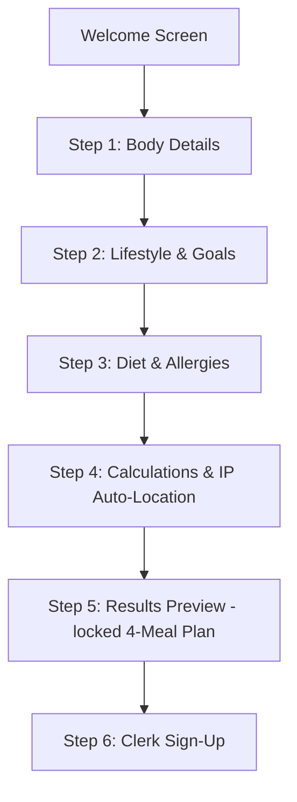

# Feature Specification: Onboarding Quiz, Results Preview, & Clerk Sign-Up

This specification details the simplified, highly optimized onboarding funnel. Users are guided through a fast, interactive biometrics and dietary questionnaire, presented with a localized 4-meal plan results preview, and prompted to sign up via Clerk to unlock the full plan.

---

## 1. Onboarding Funnel Sequence

### 1. Welcome Screen (`app/index.tsx`)
*   **Aesthetic:** Clean background with soft ambient gradient blurs, displaying a transparent, floating 3D clay avocado/salad hero image.
*   **Actions:**
    *   *Primary CTA:* `[Get Started]` (Sage green button, scale spring animation).
    *   *Secondary Link:* `[Already have an account? Sign in]`.
*   **No Name/Country input:** These are completely removed from the welcome screen to reduce onboarding friction.

### 2. Onboarding Questionnaire (3 Interactive Steps)
*   **Step 1: Body Details:**
    *   Gender cards (Male/Female side-by-side).
    *   Birth Year input.
    *   Height (cm) and Weight (kg) side-by-side inputs.
*   **Step 2: Lifestyle & Goals:**
    *   Daily activity level (Sedentary, Lightly Active, Moderately Active, Very Active).
    *   Wellness goal (Lose Weight, Maintain Weight, Gain Weight).
*   **Step 3: Diet & Food Preferences (Simplified):**
    *   *Diet Type Grid:* Select one (Classic/Anything, Vegetarian, Vegan, Keto, Low Carb).
    *   *Common Exclusions Grid:* Multi-select toggles (Gluten-Free, Dairy-Free, Nut-Free, Seafood-Free).
*   **Step 4: Calculations Loading Transition:**
    *   Displays progress loader: *"Analyzing biometrics...", "Detecting country from IP...", "Compiling custom meal plan..."*
    *   *Auto-Location logic:* Mocks location detection based on system locale/IP to determine country (EG or GB) and loads the corresponding regional recipe database automatically.

### 3. Plan Results Preview Screen (`app/onboarding_results.tsx`)
*   **Custom Target Summary:** Target calories (e.g. `1,850 kcal`) and macromolecule targets (Protein, Carbs, Fats badges).
*   **Daily 4-Meal Plan Teaser (Breakfast, Lunch, Dinner, Snack):**
    *   Presents 4 clean cards showing the meal name, type, and calories (e.g., *"Breakfast: Fava Beans & baked Falafel - 380 kcal"*).
    *   *The Lock Overlay:* The detailed ingredients list, portion sizes, and step-by-step preparation details are blurred/locked under a frosted glassmorphic overlay with a lock icon.
    *   *Quick Swap Button:* Next to each meal card, a `[Swap]` icon allows the user to slide up a **Meal Swap Bottom Sheet**.
*   **Meal Swap Bottom Sheet:**
    *   Displays 2 alternative meal card options matching their macro targets.
    *   Includes a toggle checkbox: *"Exclude [ingredient] (e.g. Bread / Rice) from future plans"*. Tapping it registers the exclusion and swaps the meal.
*   **Call-to-Action:**
    *   `[Claim My Personalized Plan & Start]` -> Opens Clerk Authentication Screen.

### 4. Post-Signup Dietary Preferences
*   Once signed up, the user can navigate to the **Profile Screen** where a dedicated **Dietary Preferences** row is added.
*   This section allows them to modify their diet types, check off ingredients they dislike (e.g. Bread, Rice), and update any other details (like Name or Country) that were skipped during onboarding.

---

## 2. Spacing & Spacing Audit Requirements

*   **No Overlap Policies:** Floating action buttons and gear overlays are strictly prohibited on onboarding and wizard pages. 
*   **Column Layout Gaps:** Multi-column inputs (e.g. Height & Weight) must use NativeWind grid spacing (`flex-row gap-4`) to prevent visual crowding.
*   **Centralized Images:** Any static placeholders or illustrative icons (like 3D avocados or lock icons) must be imported from `constants/images.ts`.
