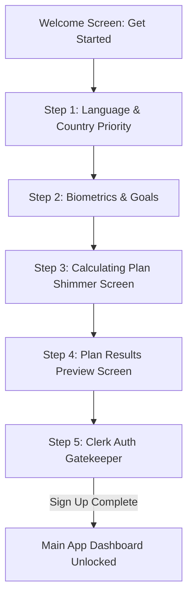

# Feature Specification: Onboarding Quiz, Results Preview, & Clerk Sign-Up

This specification details the "quiz-to-results" onboarding funnel. Users are guided through an interactive biometrics questionnaire, presented with their calculated nutrition plan, and prompted to sign up via Clerk to access their dashboard.

---

## 1. Onboarding Funnel Sequence

### 1. Welcome Screen
*   **Aesthetic:** Spacious, minimalist hero card with food outline illustrations.
*   **Tagline:** "digest: Eat smarter. Live better."
*   **Actions:**
    *   *Primary CTA:* `[Get Started]` (Sage green button, scale spring animation).
    *   *Secondary Link:* `[I already have an account / Log In]`.

### 2. Onboarding Questionnaire (Interactive Quiz)
*   **Step 1: Basics & Location:**
    *   Language selection (Arabic/English auto-toggle).
    *   Prioritized Country selection (Egyptian / UK localized database priority).
*   **Step 2: Biometrics:**
    *   Gender cards (Male/Female side-by-side with clear, equal layout spacing).
    *   Year of birth selector.
    *   Height (cm) and Weight (kg) side-by-side inputs (no absolute overlapping settings icons).
*   **Step 3: Activity & Goals:**
    *   Activity factor (Sedentary, Light, Moderate, Very Active).
    *   Health goal (Lose weight, Maintain, Gain muscle).
*   **Step 4: "Calculating Plan..." Loading Transition:**
    *   Displays a clean progress indicator showing: *"Analyzing metrics...", "Computing metabolic rate...", "Matching localized meals..."* with soft shimmering indicators.

### 3. Plan Results Preview Screen (The Hook)
Presented to the user immediately upon completing the quiz, showing what they will unlock:
*   **Custom Target Summary:**
    *   Total Daily Calories target (e.g. `1,850 kcal`).
    *   Macros Breakdown (Protein, Carbs, Fats targets visual badges).
*   **Localized Meal Recommendations Preview:**
    *   Displays 2-3 visual meal suggestion cards matching their target calories and country (e.g., if Egyptian, show a preview card for *"Grilled Kofta & Baladi Bread"*).
*   **Weight Loss Trajectory Prediction Chart:**
    *   A vector line graph showing estimated weight progress over 8 weeks (e.g., starting at 80kg, dropping to 74kg).
*   **Call-to-Action:**
    *   `[Claim My Plan & Start Tracking]` -> Routes directly to the **Clerk Auth Screen**.

### 4. Clerk Authentication Gatekeeper
*   **Screen Options:**
    *   Sign Up with Email & Password.
    *   Sign Up with Google (Mock/Placeholder button).
    *   Sign Up with Apple (Mock/Placeholder button).
*   **Post-Authentication Action:**
    *   Saves onboarding data to the Supabase database.
    *   Syncs logs and targets to Zustand.
    *   Switches `useDiaryStore.getState().isTrial` to `false` and redirects user to the main dashboard tab.

---

## 2. Spacing & Spacing Audit Requirements

*   **No Overlap Policies:** Settings gear and float overlays are prohibited on onboarding/wizard pages. All action navigation handles must be constrained to bottom button bars.
*   **Column Layout Gaps:** Multi-column inputs (e.g. Height & Weight) must use the Tailwind grid spacing (`flex-row space-x-4` or `gap-4`) to prevent visual crowding.
*   **Button Sizing Consistency:** Back/Next wizard footer buttons must be wrapped in `flex-row items-center w-full justify-between mt-8` containers with equal height tokens (`h-12`).

---
*End of Onboarding Funnel Specification.*
