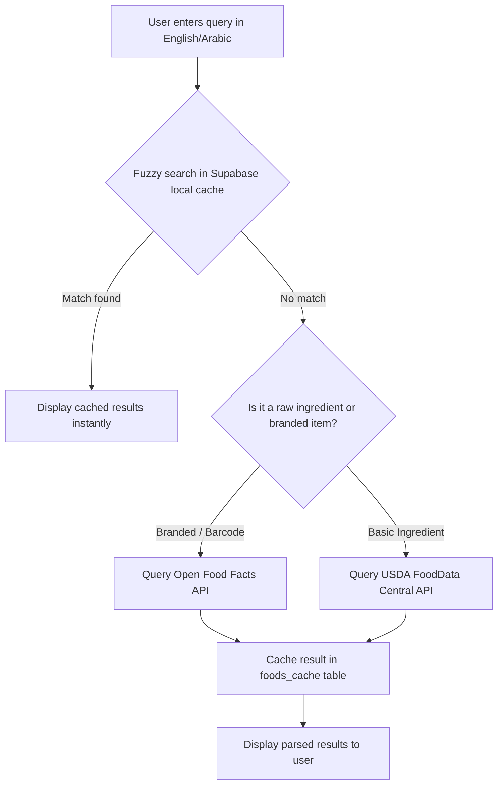

# Feature Specification: Food Tracking & Nutritional Database

This specification details multi-lingual database search, barcode scanning, USDA/Open Food Facts caching pipelines, and the system prompt for Gemini natural language meal parsing.

---

## 1. Unified Food Search & Caching Pipeline



### Database Integration Details
*   **USDA API Search:** Hits FoodData Central `https://api.nal.usda.gov/fdc/v1/foods/search` with the query.
*   **Open Food Facts API Search:** Queries `https://world.openfoodfacts.org/cgi/search.pl?search_terms=<query>&json=1`.
*   **Localization Sync:** When a food item is retrieved from USDA (English only), a background edge function calls Gemini to translate the item name and brand to Arabic (and vice-versa for Arabic-only Open Food Facts items) before inserting it into `foods_cache`.

---

## 2. Gemini Natural Language Meal Parser Prompt

When users describe their meals in natural writing (e.g., *"طبق فول بالزيت الحار ورغيف عيش سن"* or *"two scrambled eggs with 10g butter"*), the client sends the text to the Supabase Edge Function `/parse-meal`.

### The System Prompt (Gemini 3.5 Flash)
```
You are an expert nutritional scientist and multi-lingual translator. 
Your task is to parse a text description of a meal written in English, Arabic, or a mixture of both. 
Analyze the components of the meal, estimate their weights in grams, and calculate their macro and micro nutrient breakdowns.

Follow these strict rules:
1. Translate all food names into BOTH English ('name_en') and Arabic ('name_ar').
2. Estimate the weight in grams ('amount_g') for each food item if not explicitly stated (e.g., "an egg" = 50g, "a medium banana" = 120g).
3. Standardize the nutrients list to represent values per 100 grams of that food.
4. If a composite meal is described (e.g., "Koshary"), break it down into its major components or use a standardized composite entry.
5. Provide a confidence score between 0.0 and 1.0 for your estimation.
6. Return a strictly valid JSON response conforming to the schema below. Do not output markdown backticks or any wrapper text, only the raw JSON.

JSON Schema to follow:
{
  "parsed_items": [
    {
      "name_en": "String - English food name",
      "name_ar": "String - Arabic food name",
      "brand": "String or null",
      "amount_g": Number,
      "calories_per_100g": Number,
      "protein_per_100g": Number,
      "carbs_per_100g": Number,
      "fat_per_100g": Number,
      "micros_per_100g": {
        "fiber_g": Number,
        "sugar_g": Number,
        "sodium_mg": Number,
        "potassium_mg": Number,
        "calcium_mg": Number,
        "iron_mg": Number,
        "vitamin_c_mg": Number,
        "vitamin_a_mcg": Number
      },
      "confidence": Number
    }
  ]
}
```

---

## 3. Barcode Scanning Flow

Using `expo-camera`, users can scan barcodes to look up nutritional values instantly.

1.  **Permissions Check:** Request camera access. If denied, redirect to text search.
2.  **Scan Event:** Read the barcode value (EAN-13/UPC-A).
3.  **Local Check:** Query `foods_cache` where `barcode = scanned_value`.
4.  **Remote Fetch:** If not cached, query:
    `https://world.openfoodfacts.org/api/v2/product/<barcode>.json`
5.  **Data Alignment:**
    *   Map `nutriments.energy-kcal_100g` to `calories`.
    *   Map `nutriments.proteins_100g` to `protein`.
    *   Map `nutriments.carbohydrates_100g` to `carbs`.
    *   Map `nutriments.fat_100g` to `fat`.
    *   Map micro elements (`fiber_100g`, `sodium_100g`, etc.) to the micro JSONB schema.
6.  **Translation & Cache:** Call Gemini to generate the missing Arabic or English translation for the product title, then save the unified product to `foods_cache`.

---

## 4. Chronometer-Level Micronutrient Tracking

Under **Dashboard > Details** (or **Diary > Nutrient Breakdown**), the app compiles micro-nutrient sums:

*   **Vitamins:** Vitamin A (mcg), Vitamin C (mg), Vitamin D (mcg), Vitamin E (mg), Vitamin B6 (mg), Vitamin B12 (mcg), Folate (mcg).
*   **Minerals:** Calcium (mg), Iron (mg), Potassium (mg), Sodium (mg), Magnesium (mg), Zinc (mg).
*   **Carb Details:** Dietary Fiber (g), Sugars (g).
*   **Fat Details:** Saturated Fat (g), Trans Fat (g), Monounsaturated Fat (g), Polyunsaturated Fat (g), Cholesterol (mg).

### Visual Indicator
Each micro-nutrient is represented in a horizontal progress bar matching target values based on guidelines (e.g. USDA DRI / WHO guidelines) in the user's localized language.

---
*End of Specification. Next Spec: AI Vision Scanner.*
