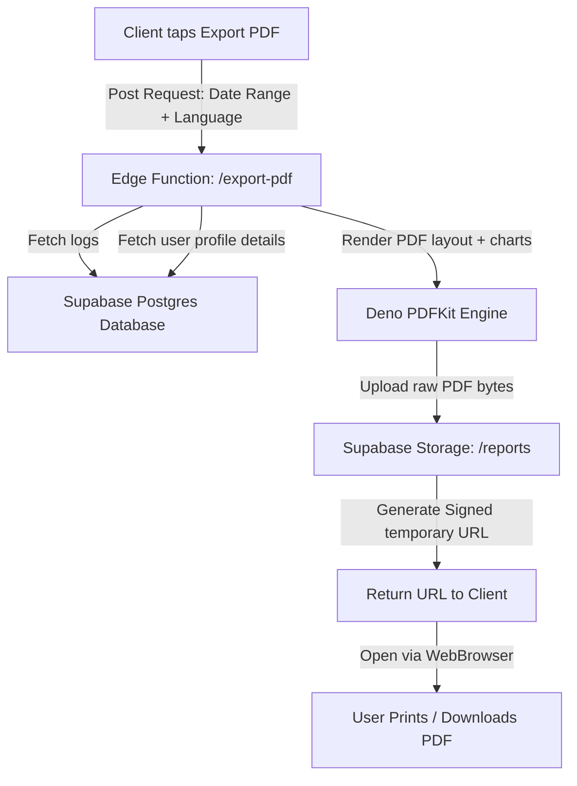

# Feature Specification: PDF Health Reports & Grocery Lists

This specification details the server-side PDF generation workflow, the structure of the weekly health summary, and how grocery list indexes are compiled for export.

---

## 1. Deno PDF Generation Architecture (Deno / PDFKit)

PDF generation is performed server-side on Supabase Edge Functions to ensure absolute compatibility, fonts packaging (for Arabic RTL typography support), and offloading heavy layout processing from the mobile device.



---

## 2. Supporting Arabic RTL Typography in PDFs

Unlike English, rendering Arabic in standard PDF engines requires text shaping and RTL reordering.
*   **Font Embedding:** The Deno Edge Function embeds a custom TrueType font file (e.g. *Cairo-Regular.ttf* or *Amiri-Regular.ttf*) supporting Arabic unicode.
*   **Arabic Text Preparation:** The text is passed through a shaping algorithm (such as `arabic-persian-reshaper` or custom RTL reversal utility) to join characters correctly before rendering to the PDF stream:

```javascript
import { reshape } from 'arabic-persian-reshaper';

// Custom Deno utility to reverse and shape strings for PDFKit
export function prepareArabicText(text) {
  const shapedText = reshape(text);
  // Reverse string order to match RTL direction rendering in PDFKit
  return shapedText.split('').reverse().join('');
}
```

---

## 3. PDF Page Structure & Mockup Layout

Each report follows a multi-page layout utilizing the **digest** premium color theme:

### Page 1: Executive Summary & Macro Balances
*   **Header Banner:** **digest** logo, Date Range (e.g. *June 01 - June 07, 2026*), User Name, Country, and Target Calorie Profile.
*   **Day-by-Day Balance Sheet:** Table showing Date, Calories Eaten, Calories Burned, and Calorie Balance relative to goals.
*   **Macro Ratio Grid:** A visual bar representation of the actual average macros compared to targets (Protein, Carbohydrates, Fats).

### Page 2: Chronometer Micronutrient Scorecard
*   **Essential Minerals Chart:** Horizontal lines representing actual/target for Calcium, Iron, Potassium, Sodium, and Magnesium.
*   **Vitamins Chart:** Vitamin A, Vitamin C, Vitamin D, and Vitamin B12 breakdown.
*   **Alert Highlights:**
    *   *Warning:* Low Vitamin D average (marked in terracotta warning color).
    *   *Optimal:* Fiber target exceeded (marked in sage green accent).

### Page 3: Weekly Meal Plan & Grocery shopping list
*   **Meal Plan grid:** Shows Breakfast, Lunch, Dinner scheduled in `meal_plans`.
*   **Aggregated Grocery List:** Summarizes ingredients and total weights needed to execute the week's meal plan (e.g. *"1.2kg Chicken Breast, 1kg Tomatoes, 500g Rice"*).

---

## 4. Supabase Storage & Delivery Flow

1.  **Unique Filename:** Reports are stored under `reports/<user_id>/digest_health_report_<timestamp>.pdf`.
2.  **Lifecycle Policy:** A Supabase Storage bucket policy automatically deletes PDF files older than 24 hours to conserve space.
3.  **Temporary Signed URL:**
    ```javascript
    const { data, error } = await supabase.storage
      .from('reports')
      .createSignedUrl(`reports/${user_id}/${filename}`, 3600); // Valid for 1 hour
    ```
4.  **Client-Side Download:** The Expo app calls `WebBrowser.openBrowserAsync(data.signedUrl)` to open the system PDF viewer where users can print or save.

---
*End of Feature Specifications.*
