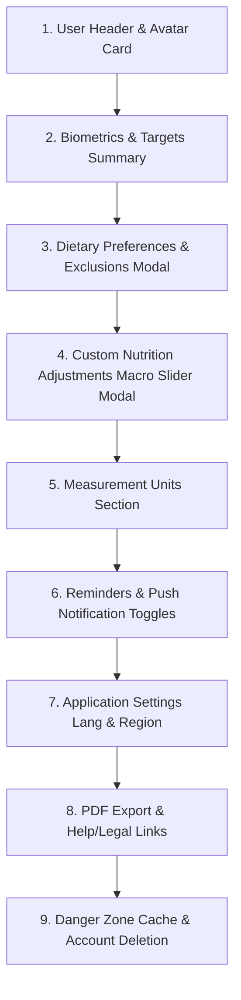

# Feature Specification: Profile Settings & Account Configuration

This specification details the comprehensive settings, biometrics, measurement units, notifications, and account management layouts inside the Profile Screen (`app/(tabs)/profile.tsx`).

---

## 1. Profile Layout Sections

The Profile Screen is structured into clean, bento-style card components with consistent vertical gap spacing.

### 1. User Header & Avatar Card
*   **Visuals:**
    *   Circular avatar placeholder with initials (e.g. "JD" for John Doe) or a mock avatar image.
    *   Name and Email.
    *   Premium/Free account badge (Sage green capsule tag).
    *   Summary caption: *"Goal: Lose Weight · Target Weight: 70 kg"*

### 2. Section 1: Biometrics & Goals (Collapsible)
*   **Fields:**
    *   Gender (Segmented male/female toggle).
    *   Age.
    *   Height (cm / in).
    *   Current Weight (kg / lbs).
    *   **Goal Weight** (kg / lbs) - *New Input.*
    *   Activity Level (Sedentary, Lightly Active, Moderately Active, Very Active).
    *   Health Goal (Lose, Maintain, Gain Weight).

### 3. Section 2: Dietary Preferences Row (Opens Full Screen Modal)
*   **Modal Fields:**
    *   *Diet Type:* Classic, Vegetarian, Vegan, Keto, Low Carb.
    *   *Common Allergies:* Gluten-Free, Dairy-Free, Nut-Free, Seafood-Free.
    *   *Excluded Ingredients List:* Chip tags of disliked ingredients (e.g., Bread, Rice) with delete buttons and an "Add" input.

### 4. Section 3: Custom Nutrition Targets (New Row / Opens Modal)
*   **Macro Split Adjuster Modal:**
    *   Segmented presets:
        *   **Balanced:** 40% Carbs, 30% Protein, 30% Fats.
        *   **High Protein:** 30% Carbs, 40% Protein, 30% Fats.
        *   **Low Carb / Keto:** 10% Carbs, 30% Protein, 60% Fats.
        *   **Custom:** Editable text inputs that must sum to exactly 100%.
    *   Saves macro targets to Zustand state (`useDiaryStore.ts`) and dynamically re-allocates target protein/carbs/fats based on target calories.

### 5. Section 4: Measurement Units
*   **Toggles:**
    *   *Weight:* `kg` vs. `lbs`
    *   *Height:* `cm` vs. `ft/in`
    *   *Water:* `ml` vs. `fl oz`
*   *State:* Stores unit preferences in Zustand and applies them across dashboard metrics.

### 6. Section 5: Reminders & Notifications
*   **Switches:**
    *   *Meal Reminders:* Toggle switch to enable morning/afternoon meal log push notification UI.
    *   *Water Reminders:* Toggle switch to enable recurring hydration alerts.
    *   *Workout Reminders:* Toggle switch to remind users to log daily MET activities.

### 7. Section 6: App Settings
*   Segmented toggle options for:
    *   *App Language:* Arabic (RTL support) vs. English.
    *   *Regional Database Priority:* Egypt (EG) vs. United Kingdom (GB).
    *   *Theme Configuration:* Light vs. Dark vs. System Default (mock segmented control).

### 8. Section 7: PDF Export & Support
*   Mint card housing **Weekly PDF Health Summary** export button.
*   Support row: `Help & FAQ` (opens modal).
*   Legal rows: `Privacy Policy` and `Terms of Service`.
*   App Version indicator: `v1.0.0 (Build 42)`.

### 9. Section 8: Danger Zone (Destructive Actions)
*   *Clear Local Cache:* Red text button that resets Zustand store and local AsyncStorage logs back to default states (with confirmation alert).
*   *Delete Account:* Red text button that opens a confirmation modal asking the user to confirm deletion (crucial for App Store guidelines compliance).
*   *Sign Out:* Standard sign-out action (calls Clerk signOut).

---

## 2. Spacing & Styling Rules

*   All rows and sections must use Tailwind flex/grid margins and padding strictly. 
*   Measurement toggles and segmented control pills should have a premium grey background (`bg-border-muted/30`) with white sliding indicator tabs.
*   Danger zone actions must be isolated at the very bottom of the ScrollView inside a grey card container with red accent labels.
