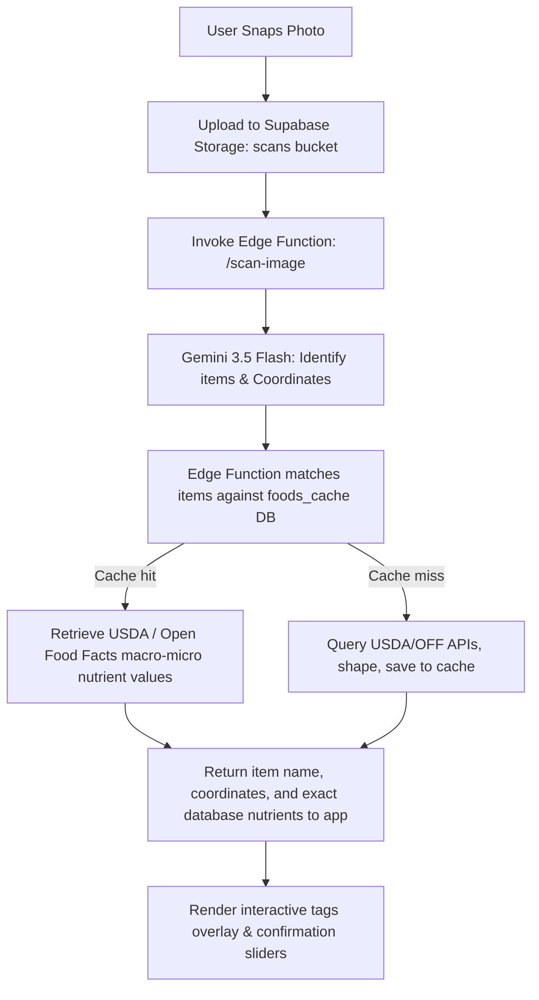

# Design Specification: Authentication & Vision Scanner Pivot

**Date:** 2026-07-17  
**Topic:** Banning Clerk for Supabase standard auth, and defining the database lookup food scanning pipeline using Gemini 3.5 Flash.

---

## 1. Project Overview & Architectural Shifts

We are pivoting two major architectural elements of the **digest** application:
1.  **Authentication:** Banish Clerk (`@clerk/clerk-expo`). Instead, we will use native Supabase Authentication (standard email/password flow) for user sessions, profile management, and Row Level Security (RLS) tokens.
2.  **AI Vision Scanner:** Stick to Gemini 3.5 Flash for multi-modal food identification and tag overlay coordinate detection. However, the estimated macros, micros, and calorie profiles will be fetched directly from our serverless database food cache (`foods_cache` which stores USDA/Open Food Facts entries) rather than letting Gemini estimate the nutritional metrics by itself.

---

## 2. Authentication Specifications (Supabase Auth)

The app will implement a production-quality authentication flow including the following features:
*   **Sign-Up Flow:**
    *   Fields: First Name, Last Name, Email Address, Password.
    *   First and last names will be capitalized and saved in the user's profile metadata or dedicated profile fields.
    *   **OTP Email Verification:** After form submission, users must enter a One-Time Password (OTP) code sent to their email via Supabase Auth to confirm their email and activate their account.
*   **Sign-In Form:**
    *   Fields: Email Address, Password.
*   **Forgot Password & Recovery Flow:**
    *   Users can request a password recovery email which sends a reset OTP code.
    *   **OTP Code Verification:** Before changing their password, users must enter the OTP code to verify their identity, then they can safely submit a new password.
*   **User Session Management:**
    *   The session JWT will be managed by the Supabase client SDK and persist locally (using `expo-secure-store` or AsyncStorage).
    *   RLS policies on Supabase tables will verify the `auth.uid()` claims to secure log entries.

---

## 3. AI Vision Scanner Pipeline Specifications

The food recognition engine is designed to balance AI computer vision capabilities with database-grade nutritional accuracy:

### Key Rules:
*   **Gemini 3.5 Flash Role:** Responsible for recognizing the food items in the image and returning their names and anchor point coordinates `[x, y]` relative to the image frame (0-100 scale).
*   **Database Lookup:** The identified food items are searched in our `foods_cache` database (which pulls from USDA FoodData Central and Open Food Facts). 
*   **Safety & Accuracy:** This protects the app from AI hallucinations regarding calories or micronutrients, ensuring users track verified laboratory nutrient indexes.

---

## 4. Updates to Guidelines (AGENTS.md)

The following edits will be committed to `AGENTS.md` to guide future feature implementations:

1.  **Tech Stack:** Update authentication stack reference from Clerk to Supabase Auth.
2.  **Supabase Auth Rules:** Replace Clerk auth rules with best practice flows (sign-up with first name, last name, email, password, sign-in, and forgot password).
3.  **Vision Scanner Rules:** Enforce the hybrid database-lookup pipeline for AI food recognition.
4.  **Important Constraints:** Update local token authentication constraints.
