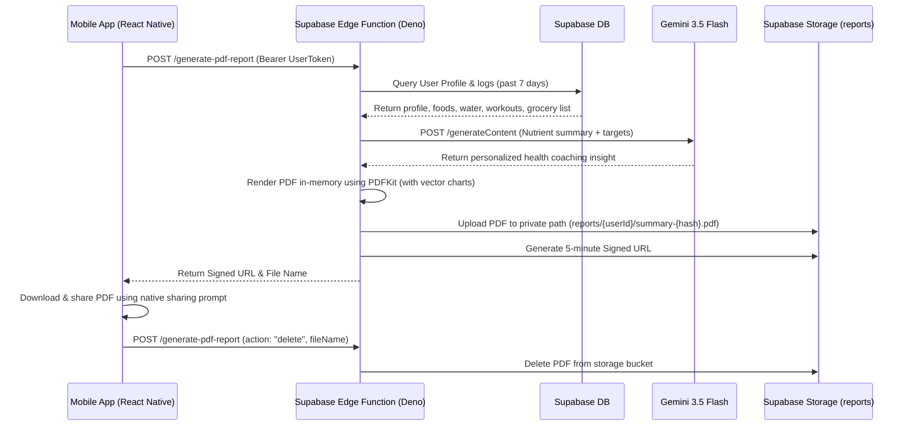

# Design Document: PDF Health Summary Export

This design document outlines the implementation plan for the **PDF Health Summary Export** feature. The summary covers a weekly report of the user's nutritional, water, activity, and grocery list stats in a premium, light-themed PDF generated using Deno PDFKit on Supabase Edge Functions.

---

## 1. Goal Description

Implement the weekly health summary PDF export as a premium, polished feature. The report compiles the user's daily food logs, water logs, workout logs, target goals, and active grocery list into a high-quality PDF. It includes personalized health insights from Gemini 3.5 Flash.

To ensure user privacy and maintain low storage consumption, the generated PDF reports are treated as temporary assets, protected by short-lived signed URLs, and aggressively deleted after download or expiry.

---

## 2. Architecture & Data Flow



---

## 3. Detailed Specifications

### 3.1. Database Queries (Aggregating 7 Days of Logs)
* **User Profile (`profiles`)**: Retrieve weight/height/water units, target calories, target macros (protein, carbs, fat), target water, country code (`EG`/`UK`), and display name.
* **Food Logs (`food_logs` + `foods_cache`)**: Retrieve logs from `logged_date >= CURRENT_DATE - 7`. Group by day, sum up Calories, Protein, Carbs, Fat, and micronutrients (Iron, Calcium, Sodium, Potassium).
* **Water Logs (`water_logs`)**: Retrieve daily water volumes for the past 7 days to calculate average daily intake.
* **Workout Logs (`workout_logs`)**: Retrieve activity name, duration, and calories burned for the past 7 days.
* **Meal Plans (`meal_plans`)**: Query the latest active meal plan to extract the `grocery_list` JSONB array.

### 3.2. Gemini AI Insights
The Edge Function will invoke Gemini 1.5 Flash using the user's profile language (`ar` or `en`). The prompt reads:
> "You are a professional nutritionist. Write a personal, friendly coaching summary for [Name] based on their weekly metrics. Daily Target Calories: [Target] kcal, Average intake: [Average] kcal. Target Macros: [Macros], Average actual macros: [Actual]. Target Water: [TargetWater], Average actual water: [ActualWater]. [Workout details]. Keep the summary to exactly 2-3 sentences. Focus on positive reinforcement or 1 actionable adjustment (e.g. eating more fiber or drinking more water)."

---

## 4. PDF Visual Design & Page Layout

The PDF uses a clean, premium light-theme palette matching the `digest` mobile app:
* **Background**: `#F8F9F8` (light gray-green)
* **Card Panels**: `#FFFFFF` (white) with `#EAECEB` borders
* **Typography**: `Helvetica` and `Helvetica-Bold` (built-in Deno PDFKit fonts)
* **Brand Sage**: `#4C6E58`
* **Brand Mint**: `#E2ECD7`
* **Nutrient Palette**: Calories (`#E58C73`), Protein (`#7E9DB0`), Carbs (`#D3B177`), Fats (`#9CA19E`)

### 4.1. Page 1: Weekly Dashboard & Nutrition
* **Header**: App Logo `"digest"` on the left in Sage. "Weekly Health Summary" title. User's metadata (Name, Goal, Country).
* **AI Health Insights Card**: Solid Mint (`#E2ECD7`) background box with `#4C6E58` border. Bold quote markup.
* **Macronutrient Dashboard**: A card drawing vector horizontal progress bars (actual averages vs. targets) for Calories, Protein, Carbs, and Fats with their respective colors.
* **Micro & Water split (Two Columns)**:
  * **Left**: Progress bars for micronutrients (Iron, Calcium, Sodium, Potassium).
  * **Right**: Water droplet icon (drawn via vector) and average water intake progress bar.

### 4.2. Page 2: Workouts, Grocery & Recommendation
* **Workout logs**: A neat table listing exercises completed, duration, and active calories burned. Highlight total energy expenditure pill at the top.
* **Grocery List Checklist**: A grid of grocery items from the meal plan with vector checkbox boxes (`[ ]`).
* **Recipe Recommendation Spotlight**: Footer card showing a healthy localized recommendation (Egyptian Lentil Soup or UK Porridge) based on user's country code.
* **Footer**: Page 2 of 2.

---

## 5. Storage & Cleanup Workflow

1. **Private Bucket**: Create a private storage bucket named `reports` with RLS policies restricting access to service role or authenticated owner.
2. **5-Minute Signed URL**: Once generated and uploaded, Deno generates a signed URL:
   ```typescript
   const { data } = await supabase.storage.from('reports').createSignedUrl(filePath, 300);
   ```
3. **On-Download Deletion**:
   * The client initiates the download/share.
   * Upon successful native share/download completion, the client invokes:
     ```typescript
     await supabase.functions.invoke('generate-pdf-report', {
       body: { action: 'delete', fileName }
     });
     ```
4. **Pre-Generation Deletion**:
   * Before generating a new PDF, the Edge Function deletes all existing PDF files under `reports/{userId}/`.
5. **Periodic Background Sweeper**:
   * Every time the Edge Function runs, it lists files in the bucket and deletes any files older than 1 hour.

---

## 6. Verification Plan

### 6.1. Edge Function Verification
* Deploy function using `supabase functions deploy generate-pdf-report`.
* Call edge function using `curl` or Postman with a test JWT token to verify response contains the signed URL and filename.
* Verify generated PDF format locally by downloading the signed URL and opening it.

### 6.2. Mobile Client Integration Verification
* Replace mock `handleExportPDF` in `app/(tabs)/profile.tsx` with the actual `supabase.functions.invoke('generate-pdf-report')` call.
* Verify loading state, success message, and file downloading/sharing sheet.
* Verify cleanup call: check that the file is deleted from Supabase Storage bucket immediately after download or modal closing.
