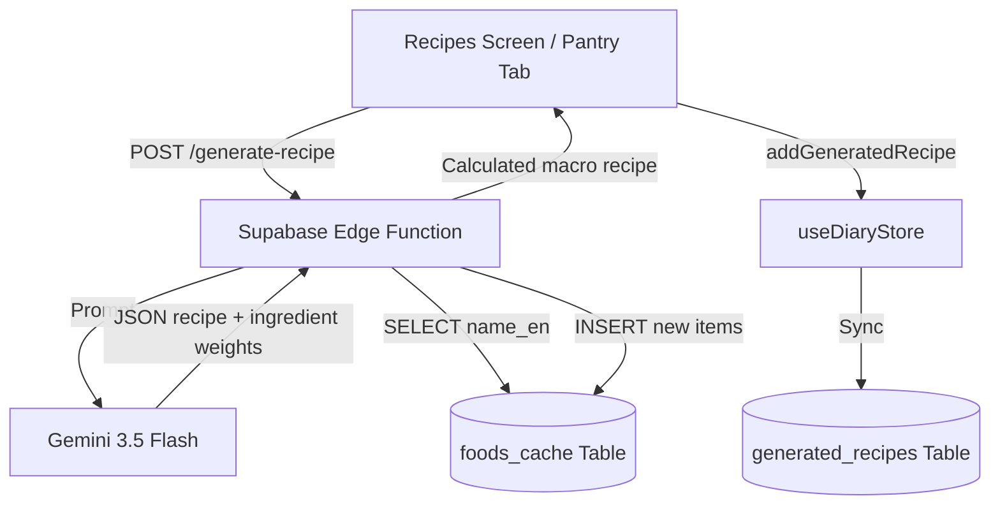

# Pantry Search & AI Recipe Generation Design

This document details the design for the Pantry Search and AI Recipe Generation feature. It introduces a comprehensive search and autocomplete interface for refrigerator ingredients, backed by a Supabase Edge Function that generates culinary-sound recipes with database-verified macro calculations.

## 1. Requirements

- **Pantry Selection UI**: The user can toggle predefined ingredients and search/add custom ingredients.
- **Search Autocomplete**: Tapping or typing in the custom ingredient input field displays a floating dropdown suggesting ingredients from a comprehensive local database of ~150 common foods (dual English/Arabic names, categorized).
- **Custom Add**: The user can type any custom ingredient and tap "+" to add it, even if it is not in the autocomplete dictionary.
- **AI Recipe Generator**: Tapping "Generate AI Recipe" queries a new Supabase Edge Function (`generate-recipe`).
- **Culinary Grounding**: The AI must produce structurally realistic, healthy, and culinary-grounded recipes.
- **Macro Calculation & Cache Lookup**:
  - The Edge Function calculates macro metrics by querying the `foods_cache` database table for each recipe ingredient.
  - If an ingredient matches a cached row (based on name), it uses the cached calories/protein/carbs/fat values per 100g.
  - If it is a miss, it falls back to Gemini's estimated macros for that ingredient and records a new `gemini:<hash>` row in `foods_cache` to keep database foreign keys clean.
  - It returns the total calculated macros.
- **Zustand State & Diary Sync**:
  - The recipe is saved to `generatedRecipes` state in the `useDiaryStore`.
  - The recipe is saved to Supabase `generated_recipes` table.
  - The user can log the generated recipe directly to their daily Food Diary.

## 2. Proposed System Architecture

### Component Diagram



## 3. Data Structure

### Local Ingredient Dictionary (`data/ingredients.ts`)
A curated dataset of ~150 common ingredients categorized:

```typescript
export interface IngredientSuggestion {
  name_en: string;
  name_ar: string;
  category: 'proteins' | 'vegetables' | 'grains' | 'dairy' | 'oils_fats' | 'spices_herbs' | 'fruits' | 'other';
  icon: string;
}

export const ingredientSuggestions: IngredientSuggestion[] = [
  { name_en: 'Chicken breast', name_ar: 'صدر دجاج', category: 'proteins', icon: '🍗' },
  { name_en: 'Fava beans', name_ar: 'فول مدمس', category: 'proteins', icon: '🌱' },
  // ... ~150 common items
];
```

### Generated Recipe Response
Conforms to the existing `RecipeType` defined in `data/localRecipes.ts`.

## 4. UI Changes

### pantry search tab (`app/(tabs)/recipes.tsx`)
- Enhance the custom ingredient input. Show a search suggestions dropdown underneath the input when the text length is > 0.
- Suggestions will filter the local `ingredientSuggestions` dictionary (matching both English and Arabic strings).
- Clicking a suggestion adds it. Clicking "+" adds the typed text.
- Change `handleGenerateRecipe` to call `supabase.functions.invoke('generate-recipe', ...)` instead of `setTimeout` mock.

## 5. Supabase Edge Function (`supabase/functions/generate-recipe/index.ts`)

- **Routing**: Accepts POST requests with authorization headers.
- **Gemini prompt instructions**:
  - Must generate realistic healthy meal recipes based on real culinary practices.
  - Ensure the recipe makes logical sense with the provided ingredients.
  - Return a structured JSON containing:
    - titles, descriptions, steps, tags (translated to ar and en).
    - a list of ingredients with name_en, name_ar, and portion weight_g.
    - Gemini's estimated macros per 100g for each ingredient as a fallback.
- **foods_cache Lookup & Calculation**:
  - Loop through each ingredient. Query `foods_cache` with `ilike` filter on `name_en`.
  - Compute portion macros: `(calories_per_100g / 100) * weight_g`.
  - Accumulate values to produce the final `total_calories`, `total_protein_g`, `total_carbs_g`, `total_fat_g` for the entire recipe.
  - If not in `foods_cache`, upsert a new `gemini:<hash>` row using Deno's crypto library to generate a stable ID.

## 6. Verification Plan

### Automated Tests
- Build verification and TypeScript check:
  ```bash
  npm run typecheck
  ```
- Linting check:
  ```bash
  npm run lint
  ```

### Manual Verification
1. Navigate to the "Pantry search" tab.
2. Search for "onion" or "بصل" in the autocomplete box. Verify that the suggestions dropdown matches and allows tapping to select.
3. Select at least 2 ingredients and tap "Generate AI Recipe".
4. Verify the loading spinner screen shows.
5. Verify the recipe is generated, navigated to, and matches the correct language layout.
6. Verify the macros listed on the details screen are sum-verified matching DB cached items.
7. Log the generated meal and verify it syncs to the Food Diary logs.
